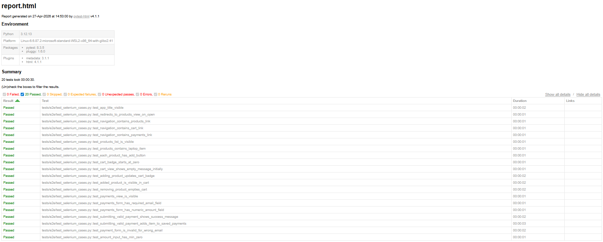

# studia-ebiznes

## lab-06-tests

Test report

[html](lab06-tests/reports/report.html)

3.0 - :white_check_mark: - [commit](https://github.com/Pug0r/studia-ebiznes/commit/7391c9f3e0718912cacfa8e2e591a4119db15793)

3.5 - :white_check_mark: - [commit](https://github.com/Pug0r/studia-ebiznes/commit/6118f778e78e466e45d573346eabd66380f4a2f6)

4.0 - :x:

4.5 - :x: 

5.0 - :x: 

## lab-05-react

https://github.com/user-attachments/assets/3783a467-bbac-4009-ba65-43c6aa00890e

3.0 - :white_check_mark: - [commit](https://github.com/Pug0r/studia-ebiznes/commit/b6368066685da3021026a99da703d96d8872e167)

3.5 - :white_check_mark: - [commit](https://github.com/Pug0r/studia-ebiznes/commit/1fbf9d566775064ecb6a1b07304173ea3f4c26d7)

4.0 - :white_check_mark: - [commit](https://github.com/Pug0r/studia-ebiznes/commit/90c25b453dc6d6478bc0b6f9c82d9fb6677a2bba)

4.5 - :white_check_mark: - dodane na 3.0

5.0 - :white_check_mark: - [commit](https://github.com/Pug0r/studia-ebiznes/commit/968c665ed64a4a4d0f784a6dec5982cf5da7c4d6)

## lab-04-go

https://github.com/user-attachments/assets/5ab417c5-f373-422c-858b-0c1337bdd2aa

3.0 - :white_check_mark: - [commit](https://github.com/Pug0r/studia-ebiznes/commit/53fd53e1301352f9251dd787a46d537c91982a6f)

3.5 - :white_check_mark: - same as above

4.0 - :white_check_mark: - [commit](https://github.com/Pug0r/studia-ebiznes/commit/7241dadbcf1740761ff948bfb89e1a109cade545)

4.5 - :white_check_mark: - [commit](https://github.com/Pug0r/studia-ebiznes/commit/d465e196b18bafe6e2b46edcf4f3c426c7b5893a)

5.0 - :x:

## lab-03-kotlin

[commit](https://github.com/Pug0r/studia-ebiznes/commit/7ee19048a9d50962cc34c9cdfe848e16cc9d423e)

https://github.com/user-attachments/assets/705614ab-12e7-4556-8ee4-d04b57da730c

3.0 - :white_check_mark:

3.5 - :white_check_mark:

4.0 - :white_check_mark:

4.5 - :white_check_mark:

5.0 - :x:

## lab-02-scala

[Relevant commit](https://github.com/Pug0r/studia-ebiznes/commit/44b8d47d30d0f7974867524a006d9fc8cc735847) and a short video of dockerised app working via ngrok.

https://github.com/user-attachments/assets/adff25de-5f27-4300-a934-bc47e1df6f84

3.0 - :white_check_mark:

3.5 - :white_check_mark:

4.0 - :white_check_mark:

4.5 - :white_check_mark:

5.0 - :white_check_mark:

## lab-01-docker

3.0 - :white_check_mark: - [obraz](https://hub.docker.com/repository/docker/pugor/ebiznes-lab01-docker/tags/3.0/sha256-28db75d5903ec9ff696de2e9b3d8e7b567d7af414b20659b99413d94c50255b2) - [dockerfile](https://github.com/Pug0r/studia-ebiznes/blob/main/lab-01-docker/3.0/dockerfile)

3.5 - :white_check_mark: - [obraz](https://hub.docker.com/repository/docker/pugor/ebiznes-lab01-docker/tags/3.5/sha256-dd0d51a9830439198d8c5ed45987c89ac374c79ef212d8f2f3e42adbe8839d35) - [dockerfile](https://github.com/Pug0r/studia-ebiznes/blob/main/lab-01-docker/3.5/dockerfile)

4.0 - :white_check_mark: - [obraz](https://hub.docker.com/repository/docker/pugor/ebiznes-lab01-docker/tags/4.0/sha256-de0913705cf39b397acd0265f4c978acda35e1925d152fa0212974ac2ed477e2) - [dockerfile](https://github.com/Pug0r/studia-ebiznes/blob/main/lab-01-docker/4.0/dockerfile)

4.5 - :white_check_mark: - [obraz](https://hub.docker.com/repository/docker/pugor/ebiznes-lab01-docker/tags/4.5/sha256-b88f0f697390b512a87cf62080b6fd8d87391030c1f6ca0ca95734d9255d1619) - [dockerfile](https://github.com/Pug0r/studia-ebiznes/tree/main/lab-01-docker/4.5)

5.0 - :white_check_mark: - [dockercompose](https://github.com/Pug0r/studia-ebiznes/tree/main/lab-01-docker/5.0)
